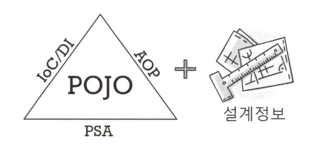
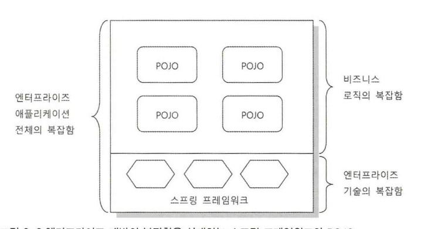

# 1. 스프링의 정의

> **자바 엔터프라이즈 개발을 편하게 해주는 오픈소스 경량급 애플리케이션 프레임워크**

1. **애플리케이션 프레임워크**
    - 라이브러리/프레임워크
        - 한 가지 기술 혹은 분야에 특화되게 만들어짐
    - 그러나 스프링은 국한되지 않고 애플리케이션의 전 영역을 포함하는 범용적 프레임워크임 → 애플리케이션 프레임워크
    - 스프링의 기원
        - *로드 존슨*의 자바 엔터프라이즈 개발 전반을 다룬 책의 예제에서부터 시작했으며, 이를 더 디벨롭하여 오픈소스 프로젝트로 확장함
    - 애플리케이션의 전 영역을 관통하는 일관된 프로그래밍 모델과 핵심 기술을 바탕으로 해 각 분야의 특성에 맞는 필요를 채워줌
2. **경량급**
    - 기본적인 개발환경으로도 개발할 수 있을 정도로 불필요하게 무겁지 않음
    - EJB, WAS를 사용하지 않아도 되니 코드를 더욱 간편하게 작성할 수 있어 생산성/품질 면에서 유리함
3. **자바 엔터프라이즈 개발을 편하게**
    - 근본적으로 엔터프라이즈 개발의 복잡함을 제거하고 개발을 편하게 해주는 해결책을 제시함
    - 개발자가 로우레벨 기술에 많은 신경을 쓰지 않으면서도 애플리케이션의 핵심인 비즈니스 로직을 빠르고 효과적으로 구현할 수 있음
4. **오픈소스**
    - 아파치 라이선스 버전 2.0
    - 오픈소스지만 실 개발은 **스프링소스**가 전담함
        - 지속적이고 안정적인 개발이 계속될지 불확실하다는 오픈소스의 문제를 해결하기 위함

  

# 2. 스프링의 목적

> 기술은 도구에 불과하다. 목적을 이해하고 도구를 잘 활용해야만 제대로 된 가치를 얻을 수 있다.

## 2.1 엔터프라이즈 개발
- 자바 엔터프라이즈 시스템 개발은 너무 복잡함
- 때문에 80% 이상의 JavaEE가 실패해왔음

### 2.1.1 복잡함의 근본적 이유
1. **기술적 제약조건과 요구사항이 늘어남**
    - 많은 사용자의 요청을 동시에 처리해야 하는 만큼 서버의 자원을 동시에 효율적으로 공유 및 분배해야 함
        - 보안, 안정성, 확장성 면에서도 뛰어나야 함
        - 분산 트랜잭션, 리모팅 기술도 요구됨
    - 핵심 비즈니스 기술 외에 개발자가 신경써야 하는 기술적 부담이 점점 커짐
2. **핵심 비즈니스 로직의 복잡함 증가**
    - IT가 발전할수록 엔터프라이즈 시스템에 대한 업무 의존도가 높아짐
    - 점점 구현해야 하는 업무 처리 기능이 어렵고 복잡해짐

### 2.1.2 복잡함을 가중시키는 원인

- 비즈니스 로직의 복잡함 + 기술적 복잡함
    - 여러 코드가 엉켜있어 유지보수 측면에서 안정성이 부족함
    - 전체적인 복잡함이 몇 배로 가중되어 개발 부담감이 커짐

 

## 2.2 복잡함 해결

### 2.2.1 근본적인 복잡함
- 개발에 나타나는 복잡함의 원인은 제거 대상이 아님
- 대신 복잡함을 효율적으로 상대할 수 있는 전략/기법이 요구됨

### 2.2.2 EJB
- 두 가지 복잡함을 분리해 비즈니스 로직 개발에 집중할 수 있도록 하자
- 분리는 성공했으나, EJB 환경에서의 동작을 위해 특정 스펙에 종속되는 코드를 만들어야 했음 → 개발적 부담이 더 증가함 (침투적인 기술)
    - 오히려 자바 언어의 장점을 상실해 스크립트성 코드로 변질되어 감

### 2.2.3 스프링
- 비침투적인 기술
    - 기술의 적용 사실이 코드에 직접 반영되지 않음
    - 성격이 다른 복잡함을 분리했으며 부가적 복잡함을 가져오지 않아 각각을 효과적으로 상대할 수 있게 됨

 

## 2.3 복잡함 상대

### 2.3.1 기술적 복잡함 상대
1. 기술에 대한 접근 방식이 일관성이 없고 특정 환경에 종속적임
    - 서비스 추상화
        - 로우레벨의 기술 구현 부분 / 사용 부분을 분리해 환경과 세부 기술에 독립적인 인터페이스를 제공
2. 기술적 처리를 담당하는 코드에 성격이 다른 코드가 섞여 등장함
    - 예외, 데이터 변환, 로깅, 감사 기능
    - AOP
        - 기술 관련 코드를 분리해 별도의 모듈로 관리하게 해줌

### 2.3.2 비즈니스와 애플리케이션 로직의 복잡함을 상대
- 비즈니스 로직에 오류가 생기면 치명적인 손실을 끼칠 수 있음
- 이전 : DB에 비즈니스 로직을 위치함
    - SQL을 통해 비즈니스 로직을 표현하고 프로시저로 로직을 처리
    - 규모가 커지며 공유 자원에 부담을 주는 것이 문제가 되고 개발/유지보수/테스트가 어려움
- 이후 : 애플리케이션 안에서 처리

### 2.3.3 핵심도구: 객체지향과 DI
- 객체지향
    - 복잡함을 해결하기 위해 사용하는 기법은 DI를 바탕으로 함
        - 이는 OO 설계 기술 없이는 존재 의미가 없음
    - DI를 열심히 사용하면 객체지향 설계의 원칙을 잘 따르고 장점을 살린 설계가 나올 수 있음
- 스프링은 자바의 객체지향이라는 특성을 극대화해서 사용하도록 도움

  

# 3. POJO

## 3.1 POJO
- Plain Old Java Object
    - 간단한 자바 오브젝트를 말함
- 스프링 삼각형
    - POJO를 이용해 만든 애플리케이션 코드
    - POJO가 어떻게 관계를 맺고 동작하는지 정의해둔 설계정보

    
    
- 스프링의 프로그래밍 모델
    - DI의 개념을 애플리케이션 전반에 걸쳐 적용시킴
- 가능기술
    - IoC/DI, AOP, PSA
    - 애플리케이션을 POJO로 개발할 수 있게 해줌

 

## 3.2 POJO의 조건

1. **특정 규약에 종속되지 않음**
    - 자바 언어와 꼭 필요한 API 외에는 종속되지 않아야 함
        - 특정 규약을 따라 비즈니스 컴포넌트를 만들 경우 X
        - 특정 클래스를 상속할 경우 단일 상속 법칙에 의해 객체지향적 설계가 어려워짐
            - + 타 환경으로의 이전이 어려워짐
    - 객체지향적 설계가 자유롭게 적용되어야 함
2. **특정 환경에 종속되지 않음**
    - EJB의 경우 JNDI 서비스를 필요로 함
    - 특정 환경에 종속적인 클래스/API가 필요한 경우
    - 순수한 애플리케이션 로직을 담고 있는 코드가 특정 환경에 종속되게 만드는 경우 POJO가 아님
    - POJO 클래스는 웹이라는 환경정보나 기술을 담고 있는 클래스를 사용하면 안됨
        - 웹 환경으로 제한하는 오브젝트에 의존해서는 안됨
    - 비즈니스 로직을 담은 코드에 HttpServletRequest, HttpSession 등 웹 프레임워크 클래스를 이용하는 부분이 있다면 POJO가 아님
    - 애노테이션 사용
        - 특정 기술에 종속되는 정보를 담는다면 POJO가 아니고 그렇지 않다면 POJO
    - POJO는 객체지향적 자바 언어의 기본에 충실하게 만들어져야 함
        - 자바 언어 문법을 사용했다고 객체지향 프로그래밍을 한 것은 아님

- POJO : 객체지향적 원리에 충실하며 환경/기술에 종속되지 않고 필요에 따라 재활용될 수 있는 방식으로 설계된 오브젝트
- POJO 프로그래밍 : POJO에 애플리케이션의 핵심 로직과 기능을 담아 설계/개발하는 방법

 

## 3.3 POJO의 장점

- 특정 기술/환경 종속 X → 깔끔한 코드
- 자동화된 테스트에 유리
- 객체지향적 설계를 자유롭게 적용할 수 있음

 

## 3.4 POJO 프레임워크

- 스프링 프레임워크
    - 모든 영역, 계층에서 POJO 방식의 구현이 가능하게 함
- 하이버네이트
    - DB 이용 기술에 POJO를 적용하는 것을 목적으로 함
- 스프링은 자신을 노출하지 않으면서 애플리케이션을 POJO로 개발할 수 있게 지원해줌

  

# 4. 스프링의 기술

> POJO 기반의 엔터프라이즈 개발을 편리하게 해주는 도구들로써 객체지향의 원리를 충실히 적용해 나온 기술들임
> 

## 4.1 IoC/DI

- 스프링의 기본이 되는 핵심 개발 원칙
- new를 사용해 직접 오브젝트를 생성해 사용하는 강한 결합보다 좋은 점은 ?
    - 유연한 확장이 가능함
        - 확장에는 열려있고 변경에는 닫혀 있어 재사용이 가능함
    - 개방 폐쇄 원칙

DI의 활용 방식에 대해 더 알아보자

### 4.1.1 핵심 기능 변경
- 의존 대상의 구현을 변경
    - 디자인 패턴 전략 패턴
- A → B 에서 A의 기능 일부를 B에게 위임한다면 B의 구현 방식을 필요에 따라 B1, B2로 바꿈

### 4.1.2 핵심 기능의 동적 변경
- 의존 오브젝트의 핵심기능 자체를 바꿈
- DI는 한 번 되고 나면 이후로 바뀌지 않음
    - 동적인 방식을 사용하나 정적인 관계를 맺음
- 다이내믹 라우팅 프록시 / 프록시 오브젝트 기법
- 예시
    - 사용자별로 독립적인 의존 오브젝트를 두게 할 수 있음

### 4.1.3 부가기능 추가

- 데코레이터 패턴
- 인터페이스를 두고 사용하게 한 후 사용하게 할 오브젝트는 외부에서 주입

### 4.1.4 인터페이스의 변경
- 클라이언트가 사용하는 인터페이스와 실제 오브젝트 사이의 인터페이스가 일치하지 않는 경우 유용
- 서비스 추상화(PSA)
    - 인터페이스가 다른 다양한 구현을 같은 방식으로 사용하도록 중간에 어댑터 레이어를 추가
    - 클라이언트가 일관성있게 사용할 인터페이스를 정의함
    - DI를 통해 어댑터 역할을 하는 오브젝트를 이용하도록 함
- 예시
    - A는 B인터페이스를 사용하나 C오브젝트를 사용하려고 함
    - C는 B인터페이스를 구현하지 않음
    - 어댑터 오브젝트를 사용해 A에 DI
        - A → B → C로 위임 → C

### 4.1.5 프록시

- lazy loading
- 호출, 원격 프록시 호출 등 다양한 기술이 프록시를 필요로 함

### 4.1.6 템플릿과 콜백

- 콜백을 템플릿에 주입하는 방식 → DI의 원리에 가장 충실한 응용 방법
- 개방을 통한 유연한 확장성을 보여줌
- 재사용도 가능하므로 OCP 폐쇄 원칙에 가장 들어맞음

### 4.1.7 싱글톤과 오브젝트 스코프

- 오브젝트의 생명주기를 제어할 수 있음
    - 대상 오브젝트를 컨테이너가 관리하기 때문에 스코프를 제어할 수 있음
- 기본적으로 싱글톤으로 오브젝트를 만들어 관리함
- 임의의 생명주기를 갖는 오브젝트가 필요한 경우도 DI 적용이 가능함

 

## 4.2 AOP

- 에스펙트 지향 프로그래밍
    - 독립적인 프로그래밍 패러다임이 아니라 OOP와 배타적이지 않음
    - 점점 복잡해지는 OOP를 보조하기 위해 사용
    - 스프링이 POJO 프로그래밍을 지원하려는 핵심 목적을 위해 사용됨

### 4.2.1 AOP 적용 기법

1. 스프링과 같이 다이내믹 프록시 사용
    - 데코레이터 패턴의 응용
    - 만들기 쉽고 적용하기 간편함
    - 메소드 호출이 일어나는 지점에만 부가기능을 부여할 수 있음
    - 대부분 해당 방법을 사용함
2. 언어의 확장
    - AspectJ 라는 AOP 툴을 이용해 조인 포인트 사용
    - 인스턴스 생성, 필드 억세스, 특정 호출 경로를 가진 메소드 호출 등에 부가기능 제공

### 4.2.2 AOP 적용 단계

1. 미리 준비된 AOP 이용
    - 트랜잭션 등 스프링이 제공하는 AOP를 이용
        - `@Configurable` : 도메인 오브젝트에 DI 자동 적용
            - 해당 어노테이션을 위해서는 AspectJ가 요구됨
2. 전담팀을 통한 정책 AOP 적용
    - 로깅, 트레이싱, 성능 모니터링과 같은 기능에 AOP 이용
3. AOP의 자유로운 이용
    - 기능에 적용하면 유용한 세부적 AOP를 이용

 

## 4.3 PSA

- 환경/기술의 변화와 관계없이 일관된 방식으로 기술에 접근할 수 있게 해줌
- POJO가 기술에 직접적으로 노출되어 만들어지지 않음
- 서비스 추상화 기술 (Portable Service Abstraction)